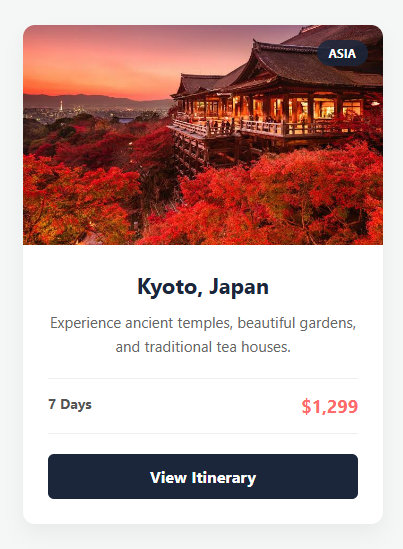
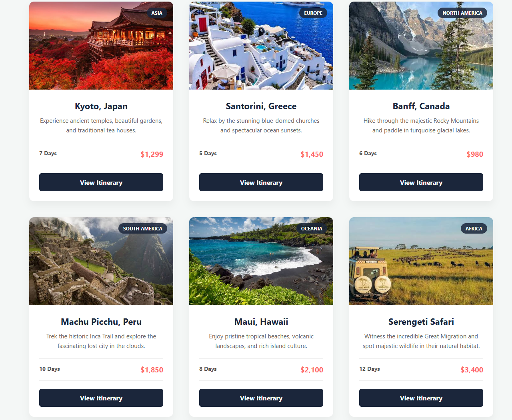

HTML & CSS — Navigation Bar and Card Design

Jasni Shrestha
2602412433
BscSE(Fundamentals of Software Engineering)
Level-4 Sem-1
Navigation Bar and Card Design

I created a webpage for travelling interested people where i have inserted a navigation bar and right below it i have our places where i have built 6 different cards containing each different places.

The technologies that i have used in this work are 
    HTML5
    CSS3
    CSS Flexbox
    CSS Grid
    Responsive CSS

Teacher's Lecture 
    -I learned the difference between generic div tags and semantic tags, as well as how to control element spacing using margin and padding.
     learned about classes id difference between them learned about styling the webpage by adding different background colors editing fonts font-sizes type and all from basics to flexbox create card navigation bar and so on.
    -I used them because they are all the basics to create a attractive webpage. 
    -I used them all in this assignment as they were all the things i requried to complete the assignment. 
chatgpt(AI)
   I learned how to align and center cards correctly, apply smooth transition effects when hovering, and create blended or semi-transparent backgrounds using multiple colors. I also improved my understanding of Flexbox and applied it effectively while completing this assignment.

## Navigation Bar

## Card Design

## Card Layout

Semantic HTML: I learned to use meaningful tags like <header>, <main>, and <nav> to logically structure the webpage for better accessibility and readability.

CSS Selectors: I learned how to use class selectors to target and style specific elements independently without accidentally affecting the rest of the page.

Box Model: I learned how to control an element's overall size and layout on the page by manipulating its margins, borders, and padding.

Flexbox: I learned to use this one-dimensional layout system to neatly align items in a single row or column, such as centering my navigation links.

Grid: I learned to use this two-dimensional layout system to build a flexible, multi-column structure for displaying the course cards simultaneously.

Typography: I learned how to establish a clear visual hierarchy and improve readability by adjusting font sizes, weights, and line heights across different text elements.

Spacing: I learned how to use margins, padding, and the gap property to give elements breathing room and prevent a cluttered, unprofessional design.

Hover Effects: I learned how to use the :hover pseudo-class and transition property to add smooth, interactive visual feedback to buttons and cards.

Responsive Design: I learned how to use @media queries to automatically adapt the layout and column structure for different screen sizes like mobile phones and desktop monitors.

Challenge 1:

I had difficulty placing the region badge directly on top of the destination image, which I solved by applying position: relative to the image wrapper and position: absolute to the badge itself.

Challenge 2:

I wanted the cards to look like they were lifting off the page on hover without shifting the grid layout, which I achieved by combining transform: translateY with a deeper box-shadow instead of using borders.

https://github.com/Sohit7794/HTML-CSS-Practical-Assignment.git